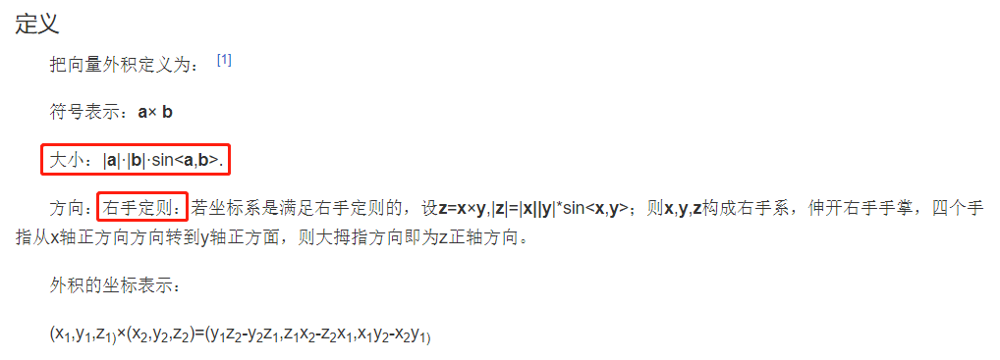
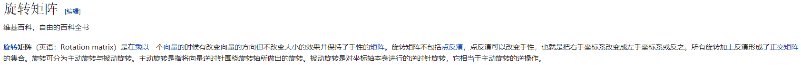
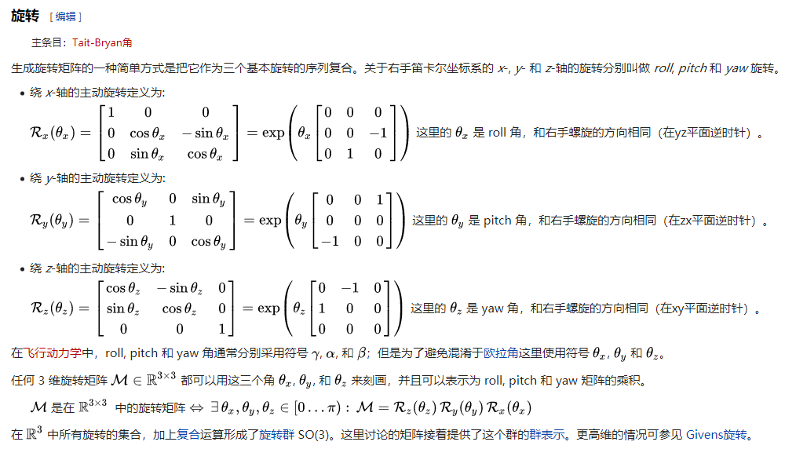
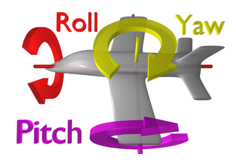
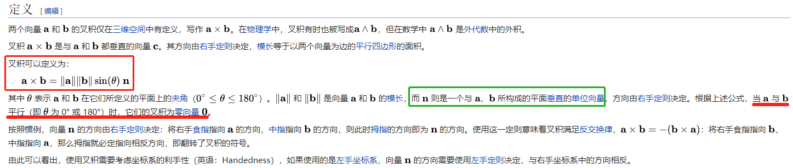
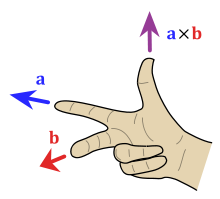
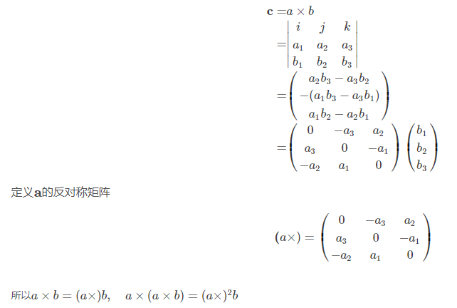

## 基本概念
1. rigid body，翻译成刚体  
2. 向量的外积  
  
3. [ 欧拉角是什么，之后为什么要引入四元数？](https://www.zhihu.com/question/47736315)  
    * 这篇文章把万象锁也说清楚了
4. 四元数的“乘法运算”，需要满足的性质（这里的乘法运算与实数集上的乘法运算具有广义的一致性后半句话是我的个人理解）：  
    1. 运算产生的结果也要是四元数
    2. 存在一个元运算，任何四元数进行元运算的结果就是其本身
    3. 对于任何一个四元数，都存在一个四元数，这两个运算的积是元运算
    4. 运算满足结合律
5. 特殊正交群 special orthogonal —— SO(3)，
6. 特殊欧式群 special euclidean —— SE(3)
7. 旋转轴，旋转向量，旋转矩阵(内容来源，[中文维基百科](https://zh.wikipedia.org/wiki/%E6%97%8B%E8%BD%AC%E7%9F%A9%E9%98%B5))
 
 
 
8. 叉积，到底是什么啊？
    * 叉积，又称向量积，计算结果是**一个向量**，见下图
        * 注意这里面最后还乘了一个向量 **n**，所以计算结果是向量（由右手法则）
        * 关于 **a** × **b** 和 **b** × **a**，计算结果向量方向的问题，参见下面另外一幅图
    * 外积，就是向量的外积，计算结果是**一个数字**
        * 与叉积不同的是，最后没有乘一个向量 **n**
    
    
8. 以两个向量叉积为例，展示如果推导出一个向量的反对称矩正，其中 **_a_** = (a1,a2,a3)的转置，
**_b_** = (b1,b2,b3)的转置
    