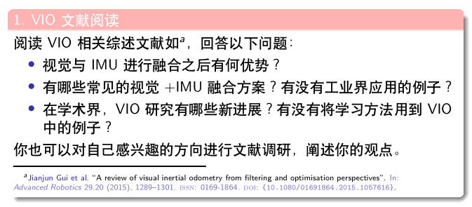
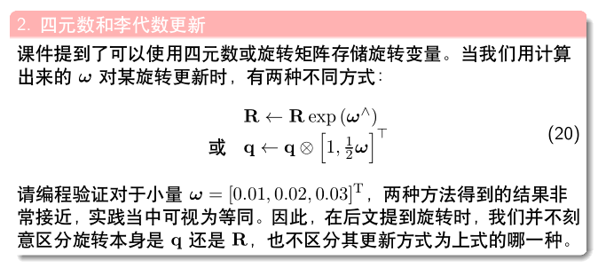
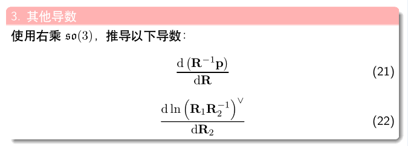

## 视觉与IMU融合的优势：
    
1. 惯性传感器设备体型较小，测量准确率高，成本相对低，适合计算短时间、快速的运动  
2. 视觉系统适合计算长时间、慢速的运动  
3. 优劣势互补有助于提高整个系统计算精度和实时性  
4. 视觉加IMU融合方案，有紧耦合松耦合之分：  
    * MSCKF
    * 非线性优化
5. 学术界VIO最新进展：首先介绍一个github上的[VIO](https://github.com/Ewenwan/MVision)项目，主要关注的方向是机器视觉，VIO占了很大篇幅，总结得非常全面非常细致，我在这里不再赘述  
    * 传统方法新进展
        * Visual-Inertial Mapping with Non-Linear Factor Recovery. 
        * VIL-VIO： Stereo Visual Inertial LiDAR Simultaneous Localization and Mapping
    * 基于深度学习方法的新进展
        * Unsupervised Deep Visual-Inertial Odometry with Online Error Correction for RGB-D Imagery. IEEE transactions on pattern analysis and machine intelligence (2019)
        * Selective Sensor Fusion for Neural Visual-Inertial Odometry. CVPR(2019)
        * Visual-Inertial Odometry for Unmanned Aerial Vehicle using Deep Learning. AIAA Scitech 2019 Forum
        * Learning by Inertia: Self-supervised Monocular Visual Odometry for Road Vehicles. ICASSP(2019)

## 编程验证
    

## 推导
    